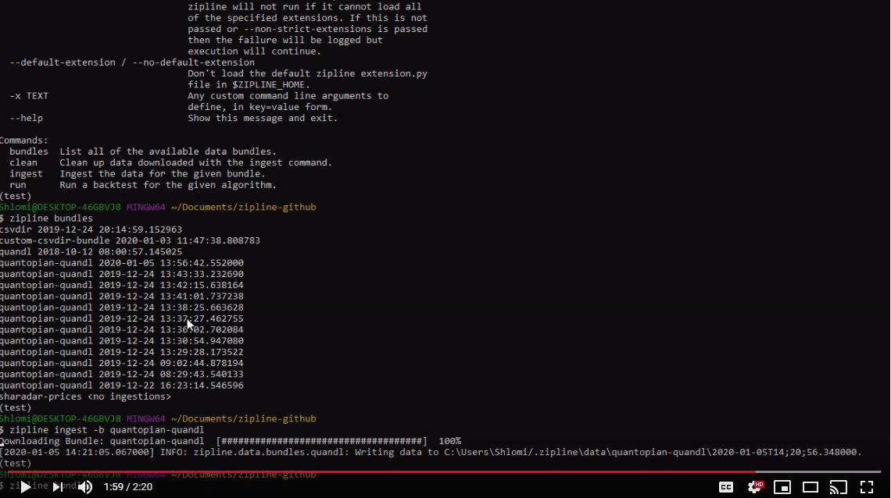
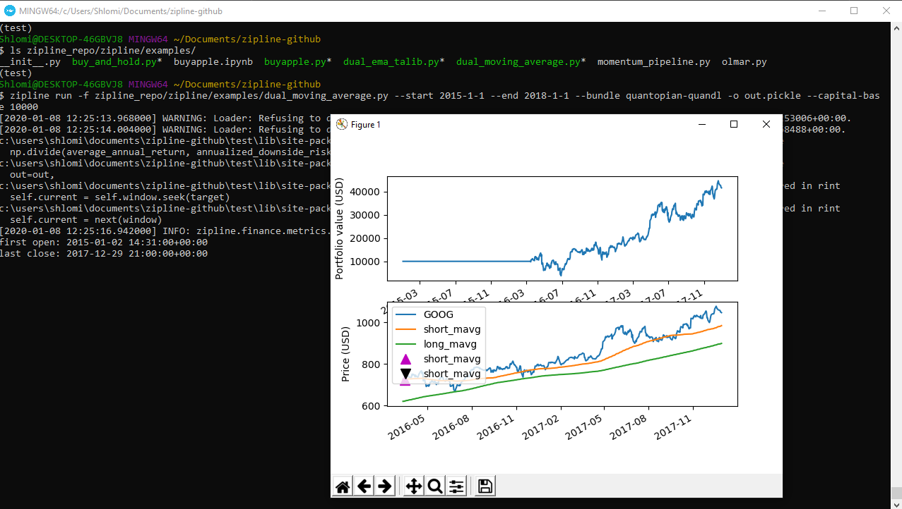

.. image:: ./images/zipline-live2.small.png
    :target: https://github.com/shlomikushchi/zipline-livetrader
    :width: 212px
    :align: center
    :alt: zipline-live

zipline-livetrader
==================

Welcome to zipline-livetrader, the on-premise trading platform built on top of Quantopian's
`zipline <https://github.com/quantopian/zipline>`_.

zipline-livetrader is based on:

- `zipline <https://github.com/quantopian/zipline>`_ project.
- `zipline-live <http://www.zipline-live.io>`_ project.
- `zipline-live2 <https://github.com/shlomikushchi/zipline-live2>`_ project.

zipline-live and zipline-live2 are past iterations of this project and this is the up to date project.

zipline-livetrader is designed to be an extensible, drop-in replacement for zipline with
multiple brokerage support to enable on premise trading of zipline algorithms.

we recommend using python 3.6+ but python 2.7 is also supported.

Installation
============
use a fresh virtual env

.. code-block:: batch

    pip install virtualenv
    virtualenv venv
    activate:
        Mac OS / Linux
            source venv/bin/activate
        Windows
            venv\Scripts\activate

installing the package:

.. code-block:: batch

    pip install zipline-livetrader

for advanced capabilities recommended way to use this package with docker using this command:

.. code-block:: docker

    docker build -t quantopian/zipline .

(if your algo requires more packages, you could extend the dockerfile-dev and install using: docker build -f dockerfile-dev-t quantopian/zipline .)

you could run everything on a local machine with whatever OS you want. but you may experience package installation issues.

this is the best way to ensure that you are using the same version everyone else use.

Ingest data
===========
the quantopian-quandl is a free daily bundle.
every day you should execute this when live trading in order to get the most updated data

.. code-block:: batch

 zipline ingest -b quantopian-quandl

there is no free minute data. you could use paid services and create a custom bundle for that.
if you do have the data, the package supports minute algo-trading.

Running Backtests
=================
you can run a backtest with this command:

.. code-block:: batch

    zipline run -f zipline_repo/zipline/examples/dual_moving_average.py --start 2015-1-1 --end 2018-1-1 --bundle quantopian-quandl -o out.pickle --capital-base 10000

Run the cli tool
================

.. code-block:: batch

    zipline run -f ~/zipline-algos/demo.py --state-file ~/zipline-algos/demo.state --realtime-bar-target ~/zipline-algos/realtime-bars/ --broker ib --broker-uri localhost:7496:1232 --bundle quantopian-quandl --data-frequency minute