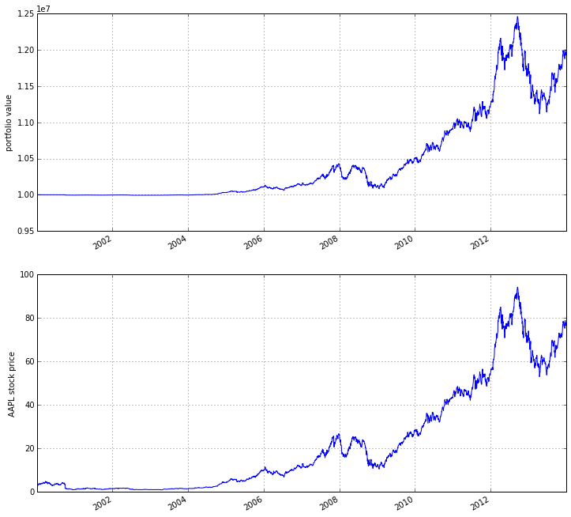
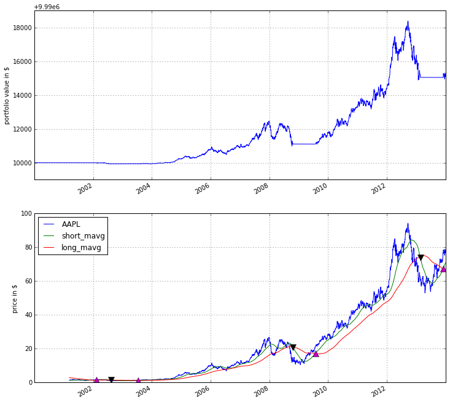

Zipline beginner tutorial
-------------------------

Basics
~~~~~~

Zipline is an open-source algorithmic trading simulator written in
Python.

The source can be found at: https://github.com/quantopian/zipline

Some benefits include:

-  Realistic: slippage, transaction costs, order delays.
-  Stream-based: Process each event individually, avoids look-ahead
   bias.
-  Batteries included: Common transforms (moving average) as well as
   common risk calculations (Sharpe).
-  Developed and continuously updated by
   `Quantopian <https://www.quantopian.com>`__ which provides an
   easy-to-use web-interface to Zipline, 10 years of minute-resolution
   historical US stock data, and live-trading capabilities. This
   tutorial is directed at users wishing to use Zipline without using
   Quantopian. If you instead want to get started on Quantopian, see
   `here <https://www.quantopian.com/faq#get-started>`__.

This tutorial assumes that you have zipline correctly installed, see the
`installation
instructions <https://github.com/quantopian/zipline#installation>`__ if
you haven't set up zipline yet.

Every ``zipline`` algorithm consists of two functions you have to
define: \* ``initialize(context)`` \* ``handle_data(context, data)``

Before the start of the algorithm, ``zipline`` calls the
``initialize()`` function and passes in a ``context`` variable.
``context`` is a persistent namespace for you to store variables you
need to access from one algorithm iteration to the next.

After the algorithm has been initialized, ``zipline`` calls the
``handle_data()`` function once for each event. At every call, it passes
the same ``context`` variable and an event-frame called ``data``
containing the current trading bar with open, high, low, and close
(OHLC) prices as well as volume for each stock in your universe. For
more information on these functions, see the `relevant part of the
Quantopian docs <https://www.quantopian.com/help#api-toplevel>`__.

My first algorithm
~~~~~~~~~~~~~~~~~~

Lets take a look at a very simple algorithm from the ``examples``
directory, ``buyapple.py``:

.. code:: python

    !tail ../../zipline/examples/buyapple.py

.. parsed-literal::

        # Load price data from yahoo.
        data = load_from_yahoo(stocks=['AAPL'], indexes={}, start=start,
                               end=end)

        # Create and run the algorithm.
        algo = TradingAlgorithm(initialize=initialize, handle_data=handle_data,
                                identifiers=['AAPL'])
        results = algo.run(data)

        analyze(results=results)

As you can see, we first have to import some functions we would like to
use. All functions commonly used in your algorithm can be found in
``zipline.api``. Here we are using ``order()`` which takes two arguments
-- a security object, and a number specifying how many stocks you would
like to order (if negative, ``order()`` will sell/short stocks). In this
case we want to order 10 shares of Apple at each iteration. For more
documentation on ``order()``, see the `Quantopian
docs <https://www.quantopian.com/help#api-order>`__.

You don't have to use the ``symbol()`` function and could just pass in
``AAPL`` directly but it is good practice as this way your code will be
Quantopian compatible.

Finally, the ``record()`` function allows you to save the value of a
variable at each iteration. You provide it with a name for the variable
together with the variable itself: ``varname=var``. After the algorithm
finished running you will have access to each variable value you tracked
with ``record()`` under the name you provided (we will see this further
below). You also see how we can access the current price data of the
AAPL stock in the ``data`` event frame (for more information see
`here <https://www.quantopian.com/help#api-event-properties>`__.

Running the algorithm
~~~~~~~~~~~~~~~~~~~~~

To now test this algorithm on financial data, ``zipline`` provides two
interfaces. A command-line interface and an ``IPython Notebook``
interface.

Command line interface
^^^^^^^^^^^^^^^^^^^^^^

After you installed zipline you should be able to execute the following
from your command line (e.g. ``cmd.exe`` on Windows, or the Terminal app
on OSX):

.. code:: python

    !run_algo.py --help

.. parsed-literal::

    usage: run_algo.py [-h] [-c FILE] [--algofile ALGOFILE] [--data-frequency {minute,daily}] [--start START] [--end END]
                       [--capital_base CAPITAL_BASE] [--source {yahoo}] [--source_time_column SOURCE_TIME_COLUMN] [--symbols SYMBOLS]
                       [--output OUTPUT] [--metadata_path METADATA_PATH] [--metadata_index METADATA_INDEX] [--print-algo] [--no-print-algo]

    Zipline version 0.8.3.

    optional arguments:
      -h, --help            show this help message and exit
      -c FILE, --conf_file FILE
                            Specify config file
      --algofile ALGOFILE, -f ALGOFILE
      --data-frequency {minute,daily}
      --start START, -s START
      --end END, -e END
      --capital_base CAPITAL_BASE
      --source {yahoo}, -d {yahoo}
      --source_time_column SOURCE_TIME_COLUMN, -t SOURCE_TIME_COLUMN
      --symbols SYMBOLS
      --output OUTPUT, -o OUTPUT
      --metadata_path METADATA_PATH, -m METADATA_PATH
      --metadata_index METADATA_INDEX, -x METADATA_INDEX
      --print-algo, -p
      --no-print-algo, -q

Note that you have to omit the preceding '!' when you call
``run_algo.py``, this is only required by the IPython Notebook in which
this tutorial was written.

As you can see there are a couple of flags that specify where to find
your algorithm (``-f``) as well as parameters specifying which stock
data to load from Yahoo! finance (``--symbols``) and the time-range
(``--start`` and ``--end``). Finally, you'll want to save the
performance metrics of your algorithm so that you can analyze how it
performed. This is done via the ``--output`` flag and will cause it to
write the performance ``DataFrame`` in the pickle Python file format.
Note that you can also define a configuration file with these parameters
that you can then conveniently pass to the ``-c`` option so that you
don't have to supply the command line args all the time (see the .conf
files in the examples directory).

Thus, to execute our algorithm from above and save the results to
``buyapple_out.pickle`` we would call ``run_algo.py`` as follows:

.. code:: python

    !run_algo.py -f ../../zipline/examples/buyapple.py --start 2000-1-1 --end 2014-1-1 --symbols AAPL -o buyapple_out.pickle

.. parsed-literal::

    AAPL
    [2015-11-04 22:45:32.820166] INFO: Performance: Simulated 3521 trading days out of 3521.
    [2015-11-04 22:45:32.820314] INFO: Performance: first open: 2000-01-03 14:31:00+00:00
    [2015-11-04 22:45:32.820401] INFO: Performance: last close: 2013-12-31 21:00:00+00:00

``run_algo.py`` first outputs the algorithm contents. It then fetches
historical price and volume data of Apple from Yahoo! finance in the
desired time range, calls the ``initialize()`` function, and then
streams the historical stock price day-by-day through ``handle_data()``.
After each call to ``handle_data()`` we instruct ``zipline`` to order 10
stocks of AAPL. After the call of the ``order()`` function, ``zipline``
enters the ordered stock and amount in the order book. After the
``handle_data()`` function has finished, ``zipline`` looks for any open
orders and tries to fill them. If the trading volume is high enough for
this stock, the order is executed after adding the commission and
applying the slippage model which models the influence of your order on
the stock price, so your algorithm will be charged more than just the
stock price \* 10. (Note, that you can also change the commission and
slippage model that ``zipline`` uses, see the `Quantopian
docs <https://www.quantopian.com/help#ide-slippage>`__ for more
information).

Note that there is also an ``analyze()`` function printed.
``run_algo.py`` will try and look for a file with the ending with
``_analyze.py`` and the same name of the algorithm (so
``buyapple_analyze.py``) or an ``analyze()`` function directly in the
script. If an ``analyze()`` function is found it will be called *after*
the simulation has finished and passed in the performance ``DataFrame``.
(The reason for allowing specification of an ``analyze()`` function in a
separate file is that this way ``buyapple.py`` remains a valid
Quantopian algorithm that you can copy&paste to the platform).

Lets take a quick look at the performance ``DataFrame``. For this, we
use ``pandas`` from inside the IPython Notebook and print the first ten
rows. Note that ``zipline`` makes heavy usage of ``pandas``, especially
for data input and outputting so it's worth spending some time to learn
it.

.. code:: python

    import pandas as pd
    perf = pd.read_pickle('buyapple_out.pickle') # read in perf DataFrame
    perf.head()

.. raw:: html

    

    <table border="1" class="dataframe">
      <thead>
        <tr style="text-align: right;">
          <th></th>
          <th>AAPL</th>
          <th>algo_volatility</th>
          <th>algorithm_period_return</th>
          <th>alpha</th>
          <th>benchmark_period_return</th>
          <th>benchmark_volatility</th>
          <th>beta</th>
          <th>capital_used</th>
          <th>ending_cash</th>
          <th>ending_exposure</th>
          <th>...</th>
          <th>short_exposure</th>
          <th>short_value</th>
          <th>shorts_count</th>
          <th>sortino</th>
          <th>starting_cash</th>
          <th>starting_exposure</th>
          <th>starting_value</th>
          <th>trading_days</th>
          <th>transactions</th>
          <th>treasury_period_return</th>
        </tr>
      </thead>
      <tbody>
        <tr>
          <th>2000-01-03 21:00:00</th>
          <td>3.738314</td>
          <td>0.000000e+00</td>
          <td>0.000000e+00</td>
          <td>-0.065800</td>
          <td>-0.009549</td>
          <td>0.000000</td>
          <td>0.000000</td>
          <td>0.00000</td>
          <td>10000000.00000</td>
          <td>0.00000</td>
          <td>...</td>
          <td>0</td>
          <td>0</td>
          <td>0</td>
          <td>0.000000</td>
          <td>10000000.00000</td>
          <td>0.00000</td>
          <td>0.00000</td>
          <td>1</td>
          <td>[]</td>
          <td>0.0658</td>
        </tr>
        <tr>
          <th>2000-01-04 21:00:00</th>
          <td>3.423135</td>
          <td>3.367492e-07</td>
          <td>-3.000000e-08</td>
          <td>-0.064897</td>
          <td>-0.047528</td>
          <td>0.323229</td>
          <td>0.000001</td>
          <td>-34.53135</td>
          <td>9999965.46865</td>
          <td>34.23135</td>
          <td>...</td>
          <td>0</td>
          <td>0</td>
          <td>0</td>
          <td>0.000000</td>
          <td>10000000.00000</td>
          <td>0.00000</td>
          <td>0.00000</td>
          <td>2</td>
          <td>[{u'order_id': u'513357725cb64a539e3dd02b47da7...</td>
          <td>0.0649</td>
        </tr>
        <tr>
          <th>2000-01-05 21:00:00</th>
          <td>3.473229</td>
          <td>4.001918e-07</td>
          <td>-9.906000e-09</td>
          <td>-0.066196</td>
          <td>-0.045697</td>
          <td>0.329321</td>
          <td>0.000001</td>
          <td>-35.03229</td>
          <td>9999930.43636</td>
          <td>69.46458</td>
          <td>...</td>
          <td>0</td>
          <td>0</td>
          <td>0</td>
          <td>0.000000</td>
          <td>9999965.46865</td>
          <td>34.23135</td>
          <td>34.23135</td>
          <td>3</td>
          <td>[{u'order_id': u'd7d4ad03cfec4d578c0d817dc3829...</td>
          <td>0.0662</td>
        </tr>
        <tr>
          <th>2000-01-06 21:00:00</th>
          <td>3.172661</td>
          <td>4.993979e-06</td>
          <td>-6.410420e-07</td>
          <td>-0.065758</td>
          <td>-0.044785</td>
          <td>0.298325</td>
          <td>-0.000006</td>
          <td>-32.02661</td>
          <td>9999898.40975</td>
          <td>95.17983</td>
          <td>...</td>
          <td>0</td>
          <td>0</td>
          <td>0</td>
          <td>-12731.780516</td>
          <td>9999930.43636</td>
          <td>69.46458</td>
          <td>69.46458</td>
          <td>4</td>
          <td>[{u'order_id': u'1fbf5e9bfd7c4d9cb2e8383e1085e...</td>
          <td>0.0657</td>
        </tr>
        <tr>
          <th>2000-01-07 21:00:00</th>
          <td>3.322945</td>
          <td>5.977002e-06</td>
          <td>-2.201900e-07</td>
          <td>-0.065206</td>
          <td>-0.018908</td>
          <td>0.375301</td>
          <td>0.000005</td>
          <td>-33.52945</td>
          <td>9999864.88030</td>
          <td>132.91780</td>
          <td>...</td>
          <td>0</td>
          <td>0</td>
          <td>0</td>
          <td>-12629.274583</td>
          <td>9999898.40975</td>
          <td>95.17983</td>
          <td>95.17983</td>
          <td>5</td>
          <td>[{u'order_id': u'9ea6b142ff09466b9113331a37437...</td>
          <td>0.0652</td>
        </tr>
      </tbody>
    </table>
    
5 rows × 39 columns

    

As you can see, there is a row for each trading day, starting on the
first business day of 2000. In the columns you can find various
information about the state of your algorithm. The very first column
``AAPL`` was placed there by the ``record()`` function mentioned earlier
and allows us to plot the price of apple. For example, we could easily
examine now how our portfolio value changed over time compared to the
AAPL stock price.

.. code:: python

    %pylab inline
    figsize(12, 12)
    import matplotlib.pyplot as plt

    ax1 = plt.subplot(211)
    perf.portfolio_value.plot(ax=ax1)
    ax1.set_ylabel('portfolio value')
    ax2 = plt.subplot(212, sharex=ax1)
    perf.AAPL.plot(ax=ax2)
    ax2.set_ylabel('AAPL stock price')

.. parsed-literal::

    Populating the interactive namespace from numpy and matplotlib

.. parsed-literal::

    <matplotlib.text.Text at 0x7ff5c6147f90>

As you can see, our algorithm performance as assessed by the
``portfolio_value`` closely matches that of the AAPL stock price. This
is not surprising as our algorithm only bought AAPL every chance it got.

IPython Notebook
~~~~~~~~~~~~~~~~

The `IPython Notebook <http://ipython.org/notebook.html>`__ is a very
powerful browser-based interface to a Python interpreter (this tutorial
was written in it). As it is already the de-facto interface for most
quantitative researchers ``zipline`` provides an easy way to run your
algorithm inside the Notebook without requiring you to use the CLI.

To use it you have to write your algorithm in a cell and let ``zipline``
know that it is supposed to run this algorithm. This is done via the
``%%zipline`` IPython magic command that is available after you
``import zipline`` from within the IPython Notebook. This magic takes
the same arguments as the command line interface described above. Thus
to run the algorithm from above with the same parameters we just have to
execute the following cell after importing ``zipline`` to register the
magic.

.. code:: python

    import zipline

.. code:: python

    %%zipline --start 2000-1-1 --end 2014-1-1 --symbols AAPL -o perf_ipython

    from zipline.api import symbol, order, record

    def initialize(context):
        pass

    def handle_data(context, data):
        order(symbol('AAPL'), 10)
        record(AAPL=data[symbol('AAPL')].price)

.. parsed-literal::

    AAPL

Note that we did not have to specify an input file as above since the
magic will use the contents of the cell and look for your algorithm
functions there. Also, instead of defining an output file we are
specifying a variable name with ``-o`` that will be created in the name
space and contain the performance ``DataFrame`` we looked at above.

.. code:: python

    perf_ipython.head()

.. raw:: html

    

    <table border="1" class="dataframe">
      <thead>
        <tr style="text-align: right;">
          <th></th>
          <th>AAPL</th>
          <th>algo_volatility</th>
          <th>algorithm_period_return</th>
          <th>alpha</th>
          <th>benchmark_period_return</th>
          <th>benchmark_volatility</th>
          <th>beta</th>
          <th>capital_used</th>
          <th>ending_cash</th>
          <th>ending_exposure</th>
          <th>...</th>
          <th>short_exposure</th>
          <th>short_value</th>
          <th>shorts_count</th>
          <th>sortino</th>
          <th>starting_cash</th>
          <th>starting_exposure</th>
          <th>starting_value</th>
          <th>trading_days</th>
          <th>transactions</th>
          <th>treasury_period_return</th>
        </tr>
      </thead>
      <tbody>
        <tr>
          <th>2000-01-03 21:00:00</th>
          <td>3.738314</td>
          <td>0.000000e+00</td>
          <td>0.000000e+00</td>
          <td>-0.065800</td>
          <td>-0.009549</td>
          <td>0.000000</td>
          <td>0.000000</td>
          <td>0.00000</td>
          <td>10000000.00000</td>
          <td>0.00000</td>
          <td>...</td>
          <td>0</td>
          <td>0</td>
          <td>0</td>
          <td>0.000000</td>
          <td>10000000.00000</td>
          <td>0.00000</td>
          <td>0.00000</td>
          <td>1</td>
          <td>[]</td>
          <td>0.0658</td>
        </tr>
        <tr>
          <th>2000-01-04 21:00:00</th>
          <td>3.423135</td>
          <td>3.367492e-07</td>
          <td>-3.000000e-08</td>
          <td>-0.064897</td>
          <td>-0.047528</td>
          <td>0.323229</td>
          <td>0.000001</td>
          <td>-34.53135</td>
          <td>9999965.46865</td>
          <td>34.23135</td>
          <td>...</td>
          <td>0</td>
          <td>0</td>
          <td>0</td>
          <td>0.000000</td>
          <td>10000000.00000</td>
          <td>0.00000</td>
          <td>0.00000</td>
          <td>2</td>
          <td>[{u'commission': 0.3, u'amount': 10, u'sid': 0...</td>
          <td>0.0649</td>
        </tr>
        <tr>
          <th>2000-01-05 21:00:00</th>
          <td>3.473229</td>
          <td>4.001918e-07</td>
          <td>-9.906000e-09</td>
          <td>-0.066196</td>
          <td>-0.045697</td>
          <td>0.329321</td>
          <td>0.000001</td>
          <td>-35.03229</td>
          <td>9999930.43636</td>
          <td>69.46458</td>
          <td>...</td>
          <td>0</td>
          <td>0</td>
          <td>0</td>
          <td>0.000000</td>
          <td>9999965.46865</td>
          <td>34.23135</td>
          <td>34.23135</td>
          <td>3</td>
          <td>[{u'commission': 0.3, u'amount': 10, u'sid': 0...</td>
          <td>0.0662</td>
        </tr>
        <tr>
          <th>2000-01-06 21:00:00</th>
          <td>3.172661</td>
          <td>4.993979e-06</td>
          <td>-6.410420e-07</td>
          <td>-0.065758</td>
          <td>-0.044785</td>
          <td>0.298325</td>
          <td>-0.000006</td>
          <td>-32.02661</td>
          <td>9999898.40975</td>
          <td>95.17983</td>
          <td>...</td>
          <td>0</td>
          <td>0</td>
          <td>0</td>
          <td>-12731.780516</td>
          <td>9999930.43636</td>
          <td>69.46458</td>
          <td>69.46458</td>
          <td>4</td>
          <td>[{u'commission': 0.3, u'amount': 10, u'sid': 0...</td>
          <td>0.0657</td>
        </tr>
        <tr>
          <th>2000-01-07 21:00:00</th>
          <td>3.322945</td>
          <td>5.977002e-06</td>
          <td>-2.201900e-07</td>
          <td>-0.065206</td>
          <td>-0.018908</td>
          <td>0.375301</td>
          <td>0.000005</td>
          <td>-33.52945</td>
          <td>9999864.88030</td>
          <td>132.91780</td>
          <td>...</td>
          <td>0</td>
          <td>0</td>
          <td>0</td>
          <td>-12629.274583</td>
          <td>9999898.40975</td>
          <td>95.17983</td>
          <td>95.17983</td>
          <td>5</td>
          <td>[{u'commission': 0.3, u'amount': 10, u'sid': 0...</td>
          <td>0.0652</td>
        </tr>
      </tbody>
    </table>
    
5 rows × 39 columns

    

Manual (advanced)
~~~~~~~~~~~~~~~~~

If you are happy with either way above you can safely skip this passage.
To provide a closer look at how ``zipline`` actually works it is
instructive to see how we run an algorithm without any of the interfaces
demonstrated above which hide the actual ``zipline`` API.

.. code:: python

    import pytz
    from datetime import datetime

    from zipline.algorithm import TradingAlgorithm
    from zipline.utils.factory import load_bars_from_yahoo

    # Load data manually from Yahoo! finance
    start = datetime(2000, 1, 1, 0, 0, 0, 0, pytz.utc)
    end = datetime(2012, 1, 1, 0, 0, 0, 0, pytz.utc)
    data = load_bars_from_yahoo(stocks=['AAPL'], start=start,
                                end=end)

    # Define algorithm
    def initialize(context):
        pass

    def handle_data(context, data):
        order(symbol('AAPL'), 10)
        record(AAPL=data[symbol('AAPL')].price)

    # Create algorithm object passing in initialize and
    # handle_data functions
    algo_obj = TradingAlgorithm(initialize=initialize,
                                handle_data=handle_data)

    # Run algorithm
    perf_manual = algo_obj.run(data)

.. parsed-literal::

    AAPL

As you can see, we again define the functions as above but we manually
pass them to the ``TradingAlgorithm`` class which is the main
``zipline`` class for running algorithms. We also manually load the data
using ``load_bars_from_yahoo()`` and pass it to the
``TradingAlgorithm.run()`` method which kicks off the backtest
simulation.

Access to previous prices using ``history``
~~~~~~~~~~~~~~~~~~~~~~~~~~~~~~~~~~~~~~~~~~~

Working example: Dual Moving Average Cross-Over
^^^^^^^^^^^^^^^^^^^^^^^^^^^^^^^^^^^^^^^^^^^^^^^

The Dual Moving Average (DMA) is a classic momentum strategy. It's
probably not used by any serious trader anymore but is still very
instructive. The basic idea is that we compute two rolling or moving
averages (mavg) -- one with a longer window that is supposed to capture
long-term trends and one shorter window that is supposed to capture
short-term trends. Once the short-mavg crosses the long-mavg from below
we assume that the stock price has upwards momentum and long the stock.
If the short-mavg crosses from above we exit the positions as we assume
the stock to go down further.

As we need to have access to previous prices to implement this strategy
we need a new concept: History

``history()`` is a convenience function that keeps a rolling window of
data for you. The first argument is the number of bars you want to
collect, the second argument is the unit (either ``'1d'`` for ``'1m'``
but note that you need to have minute-level data for using ``1m``). For
a more detailed description ``history()``'s features, see the
`Quantopian docs <https://www.quantopian.com/help#ide-history>`__. While
you can directly use the ``history()`` function on Quantopian, in
``zipline`` you have to register each history container you want to use
with ``add_history()`` and pass it the same arguments as the history
function below. Lets look at the strategy which should make this clear:

.. code:: python

    %%zipline --start 2000-1-1 --end 2014-1-1 --symbols AAPL -o perf_dma

    from zipline.api import order_target, record, symbol, history, add_history
    import numpy as np

    def initialize(context):
        # Register 2 histories that track daily prices,
        # one with a 100 window and one with a 300 day window
        add_history(100, '1d', 'price')
        add_history(300, '1d', 'price')

        context.i = 0

    def handle_data(context, data):
        # Skip first 300 days to get full windows
        context.i += 1
        if context.i < 300:
            return

        # Compute averages
        # history() has to be called with the same params
        # from above and returns a pandas dataframe.
        short_mavg = history(100, '1d', 'price').mean()
        long_mavg = history(300, '1d', 'price').mean()

        # Trading logic
        if short_mavg[0] > long_mavg[0]:
            # order_target orders as many shares as needed to
            # achieve the desired number of shares.
            order_target(symbol('AAPL'), 100)
        elif short_mavg[0] < long_mavg[0]:
            order_target(symbol('AAPL'), 0)

        # Save values for later inspection
        record(AAPL=data[symbol('AAPL')].price,
               short_mavg=short_mavg[0],
               long_mavg=long_mavg[0])

    def analyze(context, perf):
        fig = plt.figure()
        ax1 = fig.add_subplot(211)
        perf.portfolio_value.plot(ax=ax1)
        ax1.set_ylabel('portfolio value in $')

        ax2 = fig.add_subplot(212)
        perf['AAPL'].plot(ax=ax2)
        perf[['short_mavg', 'long_mavg']].plot(ax=ax2)

        perf_trans = perf.ix[[t != [] for t in perf.transactions]]
        buys = perf_trans.ix[[t[0]['amount'] > 0 for t in perf_trans.transactions]]
        sells = perf_trans.ix[
            [t[0]['amount'] < 0 for t in perf_trans.transactions]]
        ax2.plot(buys.index, perf.short_mavg.ix[buys.index],
                 '^', markersize=10, color='m')
        ax2.plot(sells.index, perf.short_mavg.ix[sells.index],
                 'v', markersize=10, color='k')
        ax2.set_ylabel('price in $')
        plt.legend(loc=0)
        plt.show()

.. parsed-literal::

    AAPL

Here we are explicitly defining an ``analyze()`` function that gets
automatically called once the backtest is done (this is not possible on
Quantopian currently).

Although it might not be directly apparent, the power of ``history()``
(pun intended) can not be under-estimated as most algorithms make use of
prior market developments in one form or another. You could easily
devise a strategy that trains a classifier with
`scikit-learn <http://scikit-learn.org/stable/>`__ which tries to
predict future market movements based on past prices (note, that most of
the ``scikit-learn`` functions require ``numpy.ndarray``\ s rather than
``pandas.DataFrame``\ s, so you can simply pass the underlying
``ndarray`` of a ``DataFrame`` via ``.values``).

We also used the ``order_target()`` function above. This and other
functions like it can make order management and portfolio rebalancing
much easier. See the `Quantopian documentation on order
functions <https://www.quantopian.com/help#api-order-methods>`__ fore
more details.

Conclusions
~~~~~~~~~~~

We hope that this tutorial gave you a little insight into the
architecture, API, and features of ``zipline``. For next steps, check
out some of the
`examples <https://github.com/quantopian/zipline/tree/master/zipline/examples>`__.

Feel free to ask questions on `our mailing
list <https://groups.google.com/forum/#!forum/zipline>`__, report
problems on our `GitHub issue
tracker <https://github.com/quantopian/zipline/issues?state=open>`__,
`get
involved <https://github.com/quantopian/zipline/wiki/Contribution-Requests>`__,
and `checkout Quantopian <https://quantopian.com>`__.
