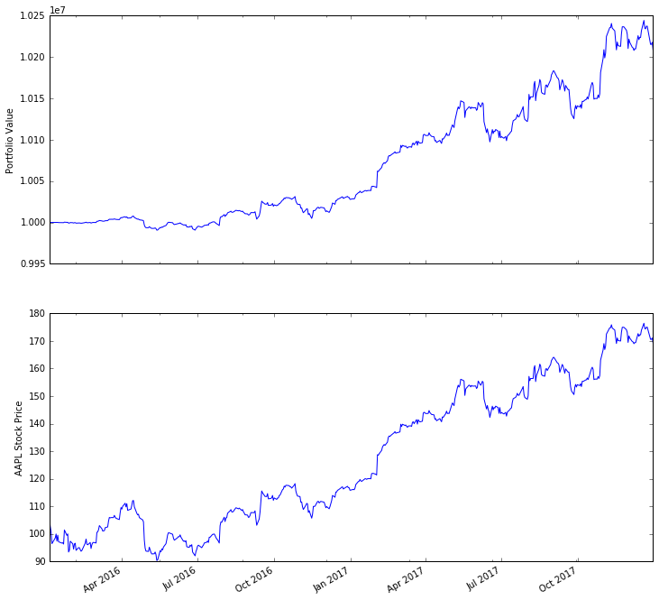
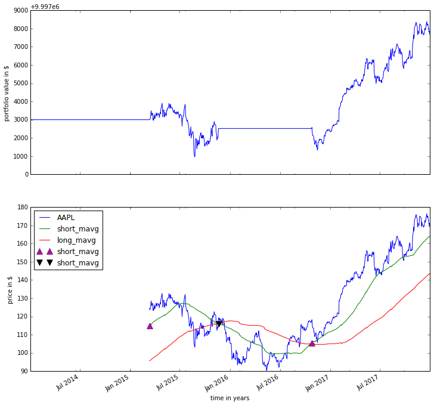

Zipline Beginner Tutorial
-------------------------

Basics
~~~~~~

Zipline is an open-source algorithmic trading simulator written in
Python.

The source can be found at: https://github.com/quantopian/zipline

Some benefits include:

-  Realistic: slippage, transaction costs, order delays.
-  Stream-based: Process each event individually, avoids look-ahead
   bias.
-  Batteries included: Common transforms (moving average) as well as
   common risk calculations (Sharpe).
-  Developed and continuously updated by
   `Quantopian <https://www.quantopian.com>`__ which provides an
   easy-to-use web-interface to Zipline, 10 years of minute-resolution
   historical US stock data, and live-trading capabilities. This
   tutorial is directed at users wishing to use Zipline without using
   Quantopian. If you instead want to get started on Quantopian, see
   `here <https://www.quantopian.com/faq#get-started>`__.

This tutorial assumes that you have zipline correctly installed, see the
`installation
instructions <https://github.com/quantopian/zipline#installation>`__ if
you haven't set up zipline yet.

Every ``zipline`` algorithm consists of two functions you have to
define:

* ``initialize(context)``
* ``handle_data(context, data)``

Before the start of the algorithm, ``zipline`` calls the
``initialize()`` function and passes in a ``context`` variable.
``context`` is a persistent namespace for you to store variables you
need to access from one algorithm iteration to the next.

After the algorithm has been initialized, ``zipline`` calls the
``handle_data()`` function once for each event. At every call, it passes
the same ``context`` variable and an event-frame called ``data``
containing the current trading bar with open, high, low, and close
(OHLC) prices as well as volume for each stock in your universe. For
more information on these functions, see the `relevant part of the
Quantopian docs <https://www.quantopian.com/help#api-toplevel>`__.

My First Algorithm
~~~~~~~~~~~~~~~~~~

Lets take a look at a very simple algorithm from the ``examples``
directory, ``buyapple.py``:

.. code-block:: python

   from zipline.examples import buyapple
   buyapple??

.. code-block:: python

   from zipline.api import order, record, symbol

   def initialize(context):
       pass

   def handle_data(context, data):
       order(symbol('AAPL'), 10)
       record(AAPL=data.current(symbol('AAPL'), 'price'))

As you can see, we first have to import some functions we would like to
use. All functions commonly used in your algorithm can be found in
``zipline.api``. Here we are using :func:`~zipline.api.order()` which takes two
arguments: a security object, and a number specifying how many stocks you would
like to order (if negative, :func:`~zipline.api.order()` will sell/short
stocks). In this case we want to order 10 shares of Apple at each iteration. For
more documentation on ``order()``, see the `Quantopian docs
<https://www.quantopian.com/help#api-order>`__.

Finally, the :func:`~zipline.api.record` function allows you to save the value
of a variable at each iteration. You provide it with a name for the variable
together with the variable itself: ``varname=var``. After the algorithm
finished running you will have access to each variable value you tracked
with :func:`~zipline.api.record` under the name you provided (we will see this
further below). You also see how we can access the current price data of the
AAPL stock in the ``data`` event frame (for more information see
`here <https://www.quantopian.com/help#api-event-properties>`__).

Running the Algorithm
~~~~~~~~~~~~~~~~~~~~~

To now test this algorithm on financial data, ``zipline`` provides three
interfaces: A command-line interface, ``IPython Notebook`` magic, and
:func:`~zipline.run_algorithm`.

Ingesting Data
^^^^^^^^^^^^^^
If you haven't ingested the data, you'll need a `Quandl <https://docs.quandl.com/docs#section-authentication>`__ API key to
ingest the default bundle. Then run:

.. code-block:: bash

   $ QUANDL_API_KEY=<yourkey> zipline ingest [-b <bundle>]

where ``<bundle>`` is the name of the bundle to ingest, defaulting to
``quandl``.

you can check out the :ref:`ingesting data <ingesting-data>` section for
more detail.

Command Line Interface
^^^^^^^^^^^^^^^^^^^^^^

After you installed zipline you should be able to execute the following
from your command line (e.g. ``cmd.exe`` on Windows, or the Terminal app
on OSX):

.. code-block:: bash

   $ zipline run --help

.. parsed-literal::

  Usage: zipline run [OPTIONS]

  Run a backtest for the given algorithm.

  Options:
   -f, --algofile FILENAME         The file that contains the algorithm to run.
   -t, --algotext TEXT             The algorithm script to run.
   -D, --define TEXT               Define a name to be bound in the namespace
                                   before executing the algotext. For example
                                   '-Dname=value'. The value may be any python
                                   expression. These are evaluated in order so
                                   they may refer to previously defined names.
   --data-frequency [daily|minute]
                                   The data frequency of the simulation.
                                   [default: daily]
   --capital-base FLOAT            The starting capital for the simulation.
                                   [default: 10000000.0]
   -b, --bundle BUNDLE-NAME        The data bundle to use for the simulation.
                                   [default: quandl]
   --bundle-timestamp TIMESTAMP    The date to lookup data on or before.
                                   [default: <current-time>]
   -s, --start DATE                The start date of the simulation.
   -e, --end DATE                  The end date of the simulation.
   -o, --output FILENAME           The location to write the perf data. If this
                                   is '-' the perf will be written to stdout.
                                   [default: -]
   --trading-calendar TRADING-CALENDAR
                                   The calendar you want to use e.g. LSE. NYSE
                                   is the default.
   --print-algo / --no-print-algo  Print the algorithm to stdout.
   --help                          Show this message and exit.

As you can see there are a couple of flags that specify where to find your
algorithm (``-f``) as well as parameters specifying which data to use,
defaulting to ``quandl``. There are also arguments for
the date range to run the algorithm over (``--start`` and ``--end``). Finally,
you'll want to save the performance metrics of your algorithm so that you can
analyze how it performed. This is done via the ``--output`` flag and will cause
it to write the performance ``DataFrame`` in the pickle Python file format.
Note that you can also define a configuration file with these parameters that
you can then conveniently pass to the ``-c`` option so that you don't have to
supply the command line args all the time (see the .conf files in the examples
directory).

Thus, to execute our algorithm from above and save the results to
``buyapple_out.pickle`` we would call ``zipline run`` as follows:

.. code-block:: python

    zipline run -f ../../zipline/examples/buyapple.py --start 2016-1-1 --end 2018-1-1 -o buyapple_out.pickle

.. parsed-literal::

    AAPL
    [2018-01-03 04:30:50.150039] WARNING: Loader: Refusing to download new benchmark data because a download succeeded at 2018-01-03 04:01:34+00:00.
    [2018-01-03 04:30:50.191479] WARNING: Loader: Refusing to download new treasury data because a download succeeded at 2018-01-03 04:01:35+00:00.
    [2018-01-03 04:30:51.843465] INFO: Performance: Simulated 503 trading days out of 503.
    [2018-01-03 04:30:51.843598] INFO: Performance: first open: 2016-01-04 14:31:00+00:00
    [2018-01-03 04:30:51.843672] INFO: Performance: last close: 2017-12-29 21:00:00+00:00

``run`` first calls the ``initialize()`` function, and then
streams the historical stock price day-by-day through ``handle_data()``.
After each call to ``handle_data()`` we instruct ``zipline`` to order 10
stocks of AAPL. After the call of the ``order()`` function, ``zipline``
enters the ordered stock and amount in the order book. After the
``handle_data()`` function has finished, ``zipline`` looks for any open
orders and tries to fill them. If the trading volume is high enough for
this stock, the order is executed after adding the commission and
applying the slippage model which models the influence of your order on
the stock price, so your algorithm will be charged more than just the
stock price \* 10. (Note, that you can also change the commission and
slippage model that ``zipline`` uses, see the `Quantopian
docs <https://www.quantopian.com/help#ide-slippage>`__ for more
information).

Lets take a quick look at the performance ``DataFrame``. For this, we
use ``pandas`` from inside the IPython Notebook and print the first ten
rows. Note that ``zipline`` makes heavy usage of ``pandas``, especially
for data input and outputting so it's worth spending some time to learn
it.

.. code-block:: python

    import pandas as pd
    perf = pd.read_pickle('buyapple_out.pickle') # read in perf DataFrame
    perf.head()

.. raw:: html

    

    <table border="1" class="dataframe">
    <thead>
      <tr style="text-align: right;">
        <th></th>
        <th>AAPL</th>
        <th>algo_volatility</th>
        <th>algorithm_period_return</th>
        <th>alpha</th>
        <th>benchmark_period_return</th>
        <th>benchmark_volatility</th>
        <th>beta</th>
        <th>capital_used</th>
        <th>ending_cash</th>
        <th>ending_exposure</th>
        <th>ending_value</th>
        <th>excess_return</th>
        <th>gross_leverage</th>
        <th>long_exposure</th>
        <th>long_value</th>
        <th>longs_count</th>
        <th>max_drawdown</th>
        <th>max_leverage</th>
        <th>net_leverage</th>
        <th>orders</th>
        <th>period_close</th>
        <th>period_label</th>
        <th>period_open</th>
        <th>pnl</th>
        <th>portfolio_value</th>
        <th>positions</th>
        <th>returns</th>
        <th>sharpe</th>
        <th>short_exposure</th>
        <th>short_value</th>
        <th>shorts_count</th>
        <th>sortino</th>
        <th>starting_cash</th>
        <th>starting_exposure</th>
        <th>starting_value</th>
        <th>trading_days</th>
        <th>transactions</th>
        <th>treasury_period_return</th>
      </tr>
    </thead>
    <tbody>
      <tr>
        <th>2016-01-04 21:00:00+00:00</th>
        <td>105.35</td>
        <td>NaN</td>
        <td>0.000000e+00</td>
        <td>NaN</td>
        <td>-0.013983</td>
        <td>NaN</td>
        <td>NaN</td>
        <td>0.0</td>
        <td>10000000.0</td>
        <td>0.0</td>
        <td>0.0</td>
        <td>0.0</td>
        <td>0.000000</td>
        <td>0.0</td>
        <td>0.0</td>
        <td>0</td>
        <td>0.000000e+00</td>
        <td>0.0</td>
        <td>0.000000</td>
        <td>[{\'dt\': 2016-01-04 21:00:00+00:00, \'reason\': N...</td>
        <td>2016-01-04 21:00:00+00:00</td>
        <td>2016-01</td>
        <td>2016-01-04 14:31:00+00:00</td>
        <td>0.0</td>
        <td>10000000.0</td>
        <td>[]</td>
        <td>0.000000e+00</td>
        <td>NaN</td>
        <td>0</td>
        <td>0</td>
        <td>0</td>
        <td>NaN</td>
        <td>10000000.0</td>
        <td>0.0</td>
        <td>0.0</td>
        <td>1</td>
        <td>[]</td>
        <td>0.0</td>
      </tr>
      <tr>
        <th>2016-01-05 21:00:00+00:00</th>
        <td>102.71</td>
        <td>0.000001</td>
        <td>-1.000000e-07</td>
        <td>-0.000022</td>
        <td>-0.012312</td>
        <td>0.175994</td>
        <td>-0.000006</td>
        <td>-1028.1</td>
        <td>9998971.9</td>
        <td>1027.1</td>
        <td>1027.1</td>
        <td>0.0</td>
        <td>0.000103</td>
        <td>1027.1</td>
        <td>1027.1</td>
        <td>1</td>
        <td>-1.000000e-07</td>
        <td>0.0</td>
        <td>0.000103</td>
        <td>[{\'dt\': 2016-01-05 21:00:00+00:00, \'reason\': N...</td>
        <td>2016-01-05 21:00:00+00:00</td>
        <td>2016-01</td>
        <td>2016-01-05 14:31:00+00:00</td>
        <td>-1.0</td>
        <td>9999999.0</td>
        <td>[{\'sid\': Equity(8 [AAPL]), \'last_sale_price\': ...</td>
        <td>-1.000000e-07</td>
        <td>-11.224972</td>
        <td>0</td>
        <td>0</td>
        <td>0</td>
        <td>-11.224972</td>
        <td>10000000.0</td>
        <td>0.0</td>
        <td>0.0</td>
        <td>2</td>
        <td>[{\'order_id\': \'4011063b5c094e82a5391527044098b...</td>
        <td>0.0</td>
      </tr>
      <tr>
        <th>2016-01-06 21:00:00+00:00</th>
        <td>100.70</td>
        <td>0.000019</td>
        <td>-2.210000e-06</td>
        <td>-0.000073</td>
        <td>-0.024771</td>
        <td>0.137853</td>
        <td>0.000054</td>
        <td>-1008.0</td>
        <td>9997963.9</td>
        <td>2014.0</td>
        <td>2014.0</td>
        <td>0.0</td>
        <td>0.000201</td>
        <td>2014.0</td>
        <td>2014.0</td>
        <td>1</td>
        <td>-2.210000e-06</td>
        <td>0.0</td>
        <td>0.000201</td>
        <td>[{\'dt\': 2016-01-06 21:00:00+00:00, \'reason\': N...</td>
        <td>2016-01-06 21:00:00+00:00</td>
        <td>2016-01</td>
        <td>2016-01-06 14:31:00+00:00</td>
        <td>-21.1</td>
        <td>9999977.9</td>
        <td>[{\'sid\': Equity(8 [AAPL]), \'last_sale_price\': ...</td>
        <td>-2.110000e-06</td>
        <td>-9.823839</td>
        <td>0</td>
        <td>0</td>
        <td>0</td>
        <td>-9.588756</td>
        <td>9998971.9</td>
        <td>1027.1</td>
        <td>1027.1</td>
        <td>3</td>
        <td>[{\'order_id\': \'3bf9fe20cc46468d99f741474226c03...</td>
        <td>0.0</td>
      </tr>
      <tr>
        <th>2016-01-07 21:00:00+00:00</th>
        <td>96.45</td>
        <td>0.000064</td>
        <td>-1.081000e-05</td>
        <td>0.000243</td>
        <td>-0.048168</td>
        <td>0.167868</td>
        <td>0.000300</td>
        <td>-965.5</td>
        <td>9996998.4</td>
        <td>2893.5</td>
        <td>2893.5</td>
        <td>0.0</td>
        <td>0.000289</td>
        <td>2893.5</td>
        <td>2893.5</td>
        <td>1</td>
        <td>-1.081000e-05</td>
        <td>0.0</td>
        <td>0.000289</td>
        <td>[{\'dt\': 2016-01-07 21:00:00+00:00, \'reason\': N...</td>
        <td>2016-01-07 21:00:00+00:00</td>
        <td>2016-01</td>
        <td>2016-01-07 14:31:00+00:00</td>
        <td>-86.0</td>
        <td>9999891.9</td>
        <td>[{\'sid\': Equity(8 [AAPL]), \'last_sale_price\': ...</td>
        <td>-8.600019e-06</td>
        <td>-10.592737</td>
        <td>0</td>
        <td>0</td>
        <td>0</td>
        <td>-9.688947</td>
        <td>9997963.9</td>
        <td>2014.0</td>
        <td>2014.0</td>
        <td>4</td>
        <td>[{\'order_id\': \'6af6aed9fbb44a6bba17e802051b94d...</td>
        <td>0.0</td>
      </tr>
      <tr>
        <th>2016-01-08 21:00:00+00:00</th>
        <td>96.96</td>
        <td>0.000063</td>
        <td>-9.380000e-06</td>
        <td>0.000466</td>
        <td>-0.058601</td>
        <td>0.145654</td>
        <td>0.000311</td>
        <td>-970.6</td>
        <td>9996027.8</td>
        <td>3878.4</td>
        <td>3878.4</td>
        <td>0.0</td>
        <td>0.000388</td>
        <td>3878.4</td>
        <td>3878.4</td>
        <td>1</td>
        <td>-1.081000e-05</td>
        <td>0.0</td>
        <td>0.000388</td>
        <td>[{\'dt\': 2016-01-08 21:00:00+00:00, \'reason\': N...</td>
        <td>2016-01-08 21:00:00+00:00</td>
        <td>2016-01</td>
        <td>2016-01-08 14:31:00+00:00</td>
        <td>14.3</td>
        <td>9999906.2</td>
        <td>[{\'sid\': Equity(8 [AAPL]), \'last_sale_price\': ...</td>
        <td>1.430015e-06</td>
        <td>-7.511729</td>
        <td>0</td>
        <td>0</td>
        <td>0</td>
        <td>-7.519659</td>
        <td>9996998.4</td>
        <td>2893.5</td>
        <td>2893.5</td>
        <td>5</td>
        <td>[{\'order_id\': \'18f64975732449a18fca06e9c69bf5c...</td>
        <td>0.0</td>
      </tr>
    </tbody>
    </table>
    

As you can see, there is a row for each trading day, starting on the
first business day of 2016. In the columns you can find various
information about the state of your algorithm. The very first column
``AAPL`` was placed there by the ``record()`` function mentioned earlier
and allows us to plot the price of apple. For example, we could easily
examine now how our portfolio value changed over time compared to the
AAPL stock price.

.. code-block:: python

    %pylab inline
    figsize(12, 12)
    import matplotlib.pyplot as plt

    ax1 = plt.subplot(211)
    perf.portfolio_value.plot(ax=ax1)
    ax1.set_ylabel('Portfolio Value')
    ax2 = plt.subplot(212, sharex=ax1)
    perf.AAPL.plot(ax=ax2)
    ax2.set_ylabel('AAPL Stock Price')

.. parsed-literal::

    Populating the interactive namespace from numpy and matplotlib

.. parsed-literal::

    <matplotlib.text.Text at 0x10c48c198>

As you can see, our algorithm performance as assessed by the
``portfolio_value`` closely matches that of the AAPL stock price. This
is not surprising as our algorithm only bought AAPL every chance it got.

IPython Notebook
~~~~~~~~~~~~~~~~

The `IPython Notebook <http://ipython.org/notebook.html>`__ is a very
powerful browser-based interface to a Python interpreter (this tutorial
was written in it). As it is already the de-facto interface for most
quantitative researchers ``zipline`` provides an easy way to run your
algorithm inside the Notebook without requiring you to use the CLI.

To use it you have to write your algorithm in a cell and let ``zipline``
know that it is supposed to run this algorithm. This is done via the
``%%zipline`` IPython magic command that is available after you
``import zipline`` from within the IPython Notebook. This magic takes
the same arguments as the command line interface described above. Thus
to run the algorithm from above with the same parameters we just have to
execute the following cell after importing ``zipline`` to register the
magic.

.. code-block:: python

   %load_ext zipline

.. code-block:: python

   %%zipline --start 2016-1-1 --end 2018-1-1
   from zipline.api import symbol, order, record

   def initialize(context):
       pass

   def handle_data(context, data):
       order(symbol('AAPL'), 10)
       record(AAPL=data[symbol('AAPL')].price)

Note that we did not have to specify an input file as above since the
magic will use the contents of the cell and look for your algorithm
functions there. Also, instead of defining an output file we are
specifying a variable name with ``-o`` that will be created in the name
space and contain the performance ``DataFrame`` we looked at above.

.. code-block:: python

   _.head()

.. raw:: html

   

   <table border="1" class="dataframe">
    <thead>
      <tr style="text-align: right;">
        <th></th>
        <th>AAPL</th>
        <th>algo_volatility</th>
        <th>algorithm_period_return</th>
        <th>alpha</th>
        <th>benchmark_period_return</th>
        <th>benchmark_volatility</th>
        <th>beta</th>
        <th>capital_used</th>
        <th>ending_cash</th>
        <th>ending_exposure</th>
        <th>ending_value</th>
        <th>excess_return</th>
        <th>gross_leverage</th>
        <th>long_exposure</th>
        <th>long_value</th>
        <th>longs_count</th>
        <th>max_drawdown</th>
        <th>max_leverage</th>
        <th>net_leverage</th>
        <th>orders</th>
        <th>period_close</th>
        <th>period_label</th>
        <th>period_open</th>
        <th>pnl</th>
        <th>portfolio_value</th>
        <th>positions</th>
        <th>returns</th>
        <th>sharpe</th>
        <th>short_exposure</th>
        <th>short_value</th>
        <th>shorts_count</th>
        <th>sortino</th>
        <th>starting_cash</th>
        <th>starting_exposure</th>
        <th>starting_value</th>
        <th>trading_days</th>
        <th>transactions</th>
        <th>treasury_period_return</th>
      </tr>
    </thead>
    <tbody>
      <tr>
        <th>2016-01-04 21:00:00+00:00</th>
        <td>105.35</td>
        <td>NaN</td>
        <td>0.000000e+00</td>
        <td>NaN</td>
        <td>-0.013983</td>
        <td>NaN</td>
        <td>NaN</td>
        <td>0.00</td>
        <td>10000000.00</td>
        <td>0.0</td>
        <td>0.0</td>
        <td>0.0</td>
        <td>0.000000</td>
        <td>0.0</td>
        <td>0.0</td>
        <td>0</td>
        <td>0.000000e+00</td>
        <td>0.0</td>
        <td>0.000000</td>
        <td>[{\'created\': 2016-01-04 21:00:00+00:00, \'reaso...</td>
        <td>2016-01-04 21:00:00+00:00</td>
        <td>2016-01</td>
        <td>2016-01-04 14:31:00+00:00</td>
        <td>0.00</td>
        <td>10000000.00</td>
        <td>[]</td>
        <td>0.000000e+00</td>
        <td>NaN</td>
        <td>0</td>
        <td>0</td>
        <td>0</td>
        <td>NaN</td>
        <td>10000000.00</td>
        <td>0.0</td>
        <td>0.0</td>
        <td>1</td>
        <td>[]</td>
        <td>0.0</td>
      </tr>
      <tr>
        <th>2016-01-05 21:00:00+00:00</th>
        <td>102.71</td>
        <td>1.122497e-08</td>
        <td>-1.000000e-09</td>
        <td>-2.247510e-07</td>
        <td>-0.012312</td>
        <td>0.175994</td>
        <td>-6.378047e-08</td>
        <td>-1027.11</td>
        <td>9998972.89</td>
        <td>1027.1</td>
        <td>1027.1</td>
        <td>0.0</td>
        <td>0.000103</td>
        <td>1027.1</td>
        <td>1027.1</td>
        <td>1</td>
        <td>-9.999999e-10</td>
        <td>0.0</td>
        <td>0.000103</td>
        <td>[{\'created\': 2016-01-04 21:00:00+00:00, \'reaso...</td>
        <td>2016-01-05 21:00:00+00:00</td>
        <td>2016-01</td>
        <td>2016-01-05 14:31:00+00:00</td>
        <td>-0.01</td>
        <td>9999999.99</td>
        <td>[{\'amount\': 10, \'cost_basis\': 102.711000000000...</td>
        <td>-1.000000e-09</td>
        <td>-11.224972</td>
        <td>0</td>
        <td>0</td>
        <td>0</td>
        <td>-11.224972</td>
        <td>10000000.00</td>
        <td>0.0</td>
        <td>0.0</td>
        <td>2</td>
        <td>[{\'dt\': 2016-01-05 21:00:00+00:00, \'order_id\':...</td>
        <td>0.0</td>
      </tr>
      <tr>
        <th>2016-01-06 21:00:00+00:00</th>
        <td>100.70</td>
        <td>1.842654e-05</td>
        <td>-2.012000e-06</td>
        <td>-4.883861e-05</td>
        <td>-0.024771</td>
        <td>0.137853</td>
        <td>5.744807e-05</td>
        <td>-1007.01</td>
        <td>9997965.88</td>
        <td>2014.0</td>
        <td>2014.0</td>
        <td>0.0</td>
        <td>0.000201</td>
        <td>2014.0</td>
        <td>2014.0</td>
        <td>1</td>
        <td>-2.012000e-06</td>
        <td>0.0</td>
        <td>0.000201</td>
        <td>[{\'created\': 2016-01-05 21:00:00+00:00, \'reaso...</td>
        <td>2016-01-06 21:00:00+00:00</td>
        <td>2016-01</td>
        <td>2016-01-06 14:31:00+00:00</td>
        <td>-20.11</td>
        <td>9999979.88</td>
        <td>[{\'amount\': 20, \'cost_basis\': 101.706000000000...</td>
        <td>-2.011000e-06</td>
        <td>-9.171989</td>
        <td>0</td>
        <td>0</td>
        <td>0</td>
        <td>-9.169708</td>
        <td>9998972.89</td>
        <td>1027.1</td>
        <td>1027.1</td>
        <td>3</td>
        <td>[{\'dt\': 2016-01-06 21:00:00+00:00, \'order_id\':...</td>
        <td>0.0</td>
      </tr>
      <tr>
        <th>2016-01-07 21:00:00+00:00</th>
        <td>96.45</td>
        <td>6.394658e-05</td>
        <td>-1.051300e-05</td>
        <td>2.633450e-04</td>
        <td>-0.048168</td>
        <td>0.167868</td>
        <td>3.005102e-04</td>
        <td>-964.51</td>
        <td>9997001.37</td>
        <td>2893.5</td>
        <td>2893.5</td>
        <td>0.0</td>
        <td>0.000289</td>
        <td>2893.5</td>
        <td>2893.5</td>
        <td>1</td>
        <td>-1.051300e-05</td>
        <td>0.0</td>
        <td>0.000289</td>
        <td>[{\'created\': 2016-01-06 21:00:00+00:00, \'reaso...</td>
        <td>2016-01-07 21:00:00+00:00</td>
        <td>2016-01</td>
        <td>2016-01-07 14:31:00+00:00</td>
        <td>-85.01</td>
        <td>9999894.87</td>
        <td>[{\'amount\': 30, \'cost_basis\': 99.9543333333335...</td>
        <td>-8.501017e-06</td>
        <td>-10.357397</td>
        <td>0</td>
        <td>0</td>
        <td>0</td>
        <td>-9.552189</td>
        <td>9997965.88</td>
        <td>2014.0</td>
        <td>2014.0</td>
        <td>4</td>
        <td>[{\'dt\': 2016-01-07 21:00:00+00:00, \'order_id\':...</td>
        <td>0.0</td>
      </tr>
      <tr>
        <th>2016-01-08 21:00:00+00:00</th>
        <td>96.96</td>
        <td>6.275294e-05</td>
        <td>-8.984000e-06</td>
        <td>4.879306e-04</td>
        <td>-0.058601</td>
        <td>0.145654</td>
        <td>3.118401e-04</td>
        <td>-969.61</td>
        <td>9996031.76</td>
        <td>3878.4</td>
        <td>3878.4</td>
        <td>0.0</td>
        <td>0.000388</td>
        <td>3878.4</td>
        <td>3878.4</td>
        <td>1</td>
        <td>-1.051300e-05</td>
        <td>0.0</td>
        <td>0.000388</td>
        <td>[{\'created\': 2016-01-07 21:00:00+00:00, \'reaso...</td>
        <td>2016-01-08 21:00:00+00:00</td>
        <td>2016-01</td>
        <td>2016-01-08 14:31:00+00:00</td>
        <td>15.29</td>
        <td>9999910.16</td>
        <td>[{\'amount\': 40, \'cost_basis\': 99.2060000000002...</td>
        <td>1.529016e-06</td>
        <td>-7.215497</td>
        <td>0</td>
        <td>0</td>
        <td>0</td>
        <td>-7.301134</td>
        <td>9997001.37</td>
        <td>2893.5</td>
        <td>2893.5</td>
        <td>5</td>
        <td>[{\'dt\': 2016-01-08 21:00:00+00:00, \'order_id\':...</td>
        <td>0.0</td>
      </tr>
    </tbody>
   </table>
   

Access to Previous Prices Using ``history``
~~~~~~~~~~~~~~~~~~~~~~~~~~~~~~~~~~~~~~~~~~~

Working example: Dual Moving Average Cross-Over
^^^^^^^^^^^^^^^^^^^^^^^^^^^^^^^^^^^^^^^^^^^^^^^

The Dual Moving Average (DMA) is a classic momentum strategy. It's
probably not used by any serious trader anymore but is still very
instructive. The basic idea is that we compute two rolling or moving
averages (mavg) -- one with a longer window that is supposed to capture
long-term trends and one shorter window that is supposed to capture
short-term trends. Once the short-mavg crosses the long-mavg from below
we assume that the stock price has upwards momentum and long the stock.
If the short-mavg crosses from above we exit the positions as we assume
the stock to go down further.

As we need to have access to previous prices to implement this strategy
we need a new concept: History

``data.history()`` is a convenience function that keeps a rolling window of
data for you. The first argument is the number of bars you want to
collect, the second argument is the unit (either ``'1d'`` or ``'1m'``,
but note that you need to have minute-level data for using ``1m``). For
a more detailed description of ``history()``'s features, see the
`Quantopian docs <https://www.quantopian.com/help#ide-history>`__.
Let's look at the strategy which should make this clear:

.. code-block:: python

   %%zipline --start 2014-1-1 --end 2018-1-1 -o dma.pickle

   from zipline.api import order_target, record, symbol
   import matplotlib.pyplot as plt

   def initialize(context):
       context.i = 0
       context.asset = symbol('AAPL')

   def handle_data(context, data):
       # Skip first 300 days to get full windows
       context.i += 1
       if context.i < 300:
           return

       # Compute averages
       # data.history() has to be called with the same params
       # from above and returns a pandas dataframe.
       short_mavg = data.history(context.asset, 'price', bar_count=100, frequency="1d").mean()
       long_mavg = data.history(context.asset, 'price', bar_count=300, frequency="1d").mean()

       # Trading logic
       if short_mavg > long_mavg:
           # order_target orders as many shares as needed to
           # achieve the desired number of shares.
           order_target(context.asset, 100)
       elif short_mavg < long_mavg:
           order_target(context.asset, 0)

       # Save values for later inspection
       record(AAPL=data.current(context.asset, 'price'),
              short_mavg=short_mavg,
              long_mavg=long_mavg)

   def analyze(context, perf):
       fig = plt.figure()
       ax1 = fig.add_subplot(211)
       perf.portfolio_value.plot(ax=ax1)
       ax1.set_ylabel('portfolio value in $')

       ax2 = fig.add_subplot(212)
       perf['AAPL'].plot(ax=ax2)
       perf[['short_mavg', 'long_mavg']].plot(ax=ax2)

       perf_trans = perf.ix[[t != [] for t in perf.transactions]]
       buys = perf_trans.ix[[t[0]['amount'] > 0 for t in perf_trans.transactions]]
       sells = perf_trans.ix[
           [t[0]['amount'] < 0 for t in perf_trans.transactions]]
       ax2.plot(buys.index, perf.short_mavg.ix[buys.index],
                '^', markersize=10, color='m')
       ax2.plot(sells.index, perf.short_mavg.ix[sells.index],
                'v', markersize=10, color='k')
       ax2.set_ylabel('price in $')
       plt.legend(loc=0)
       plt.show()

Here we are explicitly defining an ``analyze()`` function that gets
automatically called once the backtest is done (this is not possible on
Quantopian currently).

Although it might not be directly apparent, the power of ``history()``
(pun intended) can not be under-estimated as most algorithms make use of
prior market developments in one form or another. You could easily
devise a strategy that trains a classifier with
`scikit-learn <http://scikit-learn.org/stable/>`__ which tries to
predict future market movements based on past prices (note, that most of
the ``scikit-learn`` functions require ``numpy.ndarray``\ s rather than
``pandas.DataFrame``\ s, so you can simply pass the underlying
``ndarray`` of a ``DataFrame`` via ``.values``).

We also used the ``order_target()`` function above. This and other
functions like it can make order management and portfolio rebalancing
much easier. See the `Quantopian documentation on order
functions <https://www.quantopian.com/help#api-order-methods>`__ for
more details.

Conclusions
~~~~~~~~~~~

We hope that this tutorial gave you a little insight into the
architecture, API, and features of ``zipline``. For next steps, check
out some of the
`examples <https://github.com/quantopian/zipline/tree/master/zipline/examples>`__.

Feel free to ask questions on `our mailing
list <https://groups.google.com/forum/#!forum/zipline>`__, report
problems on our `GitHub issue
tracker <https://github.com/quantopian/zipline/issues?state=open>`__,
`get
involved <https://github.com/quantopian/zipline/wiki/Contribution-Requests>`__,
and `checkout Quantopian <https://quantopian.com>`__.
