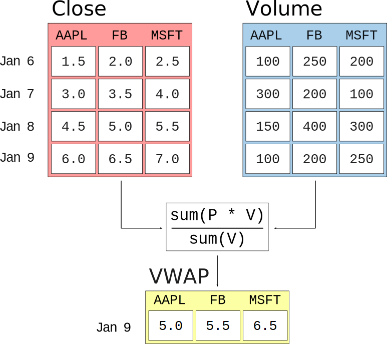

===============
Getting Started
===============

It's easiest to understand the basic concepts of the Modeling API after walking
through an example.

A First Example
~~~~~~~~~~~~~~~

In the algorithm below, we use the Modeling API to declare our desire to
compute 10 and 30 day `Simple Moving Averages`_ of close price.  We also
specify that each day we want to filter down to just stocks with a moving
average price of $5.00 or less. [#badideanote]_ Finally, in our
``before_trading_start``, we print the first five rows our computed result by
accessing ``data.factors``.

.. code-block:: Python

   from zipline.data.equities import USEquityPricing
   from zipline.modelling.factor.technical import SimpleMovingAverage

   def initialize(context):
       sma_10 = SimpleMovingAverage(inputs=[USEquityPricing.close], window_length=10)
       sma_30 = SimpleMovingAverage(inputs=[USEquityPricing.close], window_length=30)
       prices_under_5 = (sma_10 < 5)

       add_factor(sma_10, name='sma_10')
       add_factor(sma_30, name='sma_30')

       add_filter(prices_under_5)

   def before_trading_start(context, data):
       print data.factors.head(5)

On each ``before_trading_start`` call, our algorithm will display a
:class:`pandas.DataFrame` containing data like this:

==================  ==========  ==========
             index      sma_10      sma_30
==================  ==========  ==========
Equity(21 [AAME])     2.012222    1.964269
Equity(37 [ABCW])     1.226000    1.131233
Equity(58 [SERV])     2.283000    2.309255
Equity(117 [AEY])     3.150200    3.333067
Equity(225 [AHPI])    4.286000    4.228846
==================  ==========  ==========

We can break down our example algorithm into four parts:

.. contents::
   :depth: 1
   :local:

Importing Datasets
~~~~~~~~~~~~~~~~~~

The first thing our algorithm does is import the
:class:`~zipline.data.equities.USEquityPricing` class from
:mod:`zipline.data.equities`.

.. code-block:: Python

   from zipline.data.equities import USEquityPricing

:class:`~zipline.data.equities.USEquityPricing` is an example of a
:class:`~zipline.data.dataset.Dataset`.  The most important thing to understand
about Datasets is that **they do not hold actual data**.  Datasets are
**collections of sentinel values** that tell the Modeling API where and how to
find the inputs to your computations.

:class:`~zipline.data.equities.USEquityPricing` provides five public
attributes:

* :attr:`~zipline.data.equities.USEquityPricing.open` [#opennote]_
* :attr:`~zipline.data.equities.USEquityPricing.high`
* :attr:`~zipline.data.equities.USEquityPricing.low`
* :attr:`~zipline.data.equities.USEquityPricing.close`
* :attr:`~zipline.data.equities.USEquityPricing.volume`

Each of these attributes is an instance of
:class:`~zipline.data.dataset.BoundColumn`.  :ref:`See Below <declaring>` for more
details on working with BoundColumns.

Another :class:`~zipline.data.dataset.Dataset` available on Quantopian is
:class:`Fundamentals` (note the capital **F**!).  Its structure mirrors that of
the built-in :mod:`fundamentals` object that provides SQLAlchemy_ models for
use with the :func:`get_fundamentals` API method.  For example,
:attr:`Fundamentals.valuation.shares_outstanding` is a column representing for
the number of shares outstanding for an asset on each date.  See the Quantopian
`Fundamentals Reference`_ for a full description of all attributes available
from this dataset.

.. warning::

   The Modeling API currently only supports loading columns that can be coerced
   to floating-point values.  This means that we currently support loading
   columns whose database representation is either an integer, a boolean, or a
   float.  Notable, this means that we **do not** yet support ``datetime`` or
   ``str`` columns.  We expect to expand support for more complex types during
   the implementation of classifiers [#classifiernote]_.

.. warning::

   The import paths of Modeling API datasets are likely to change in the near
   future.  In particular, the ``Fundamentals`` dataset, which is currently
   pre-imported into the Quantopian namespace, will be moved to a new
   ``quantopian.data`` module.

.. _declaring:

Building Transformations
~~~~~~~~~~~~~~~~~~~~~~~~

Once we've imported the Datasets we intend to use in our algorithm, our next
step is to build the transformations we want the modeling engine to compute
each day.

.. code-block:: Python

   from zipline.modelling.factor.technical import SimpleMovingAverage

   def initialize(context):
       sma_10 = SimpleMovingAverage(inputs=[USEquityPricing.close], window_length=10)
       sma_30 = SimpleMovingAverage(inputs=[USEquityPricing.close], window_length=30)

The :class:`~zipline.modelling.factor.technical.SimpleMovingAverage` class we
import here is an example of a :class:`~zipline.modelling.factor.Factor`.
Factors, in the Modeling API, are **objects that represent reductions on
trailing windows of data**.  Every :class:`~zipline.modelling.factor.Factor`
stores three pieces of state:

1. ``inputs``: A list of :class:`~zipline.data.dataset.BoundColumn` objects
   describing the inputs to the Factor.
2. ``window_length`` : An integer describing how many rows of historical data
   the Factor needs each day to compute.
3. A ``compute`` function that operates on the data described by ``inputs`` and
   ``window_length``.

   ..

   Example Factor: Volume-Weighted Average Price

When we compute a :class:`~zipline.modelling.factor.Factor` for a day on which
we have ``N`` assets alive in our database, the Modeling API engine provides
that Factor's ``compute`` function a two-dimensional array of shape
``(window_length x N)`` for each input in ``inputs``.  The job of the compute
function is to produce a one-dimensional array of length ``N`` as an output.

The figure to the right shows the computation performed on a single day by
another built-in Factor, :class:`zipline.modelling.factor.technical.VWAP`.

.. code-block:: Python

   prices_under_5 = (sma_10 < 5)

The third line of our example algorithm constructs a
:class:`~zipline.modelling.filter.Filter`.  Like Factors, Filters are
reductions over input data defined by Datasets.  The difference between Filters
and Factors is that **Filters produce boolean-valued outputs** and **Factors
produce numerical-valued outputs**.  The expression ``(sma_10 < 5)`` uses
`Operator Overloading`_ to construct a
:class:`~zipline.modelling.filter.Filter` whose ``compute`` is equivalent to
"compute 10-day moving average price for each asset, then return an array
containing ``True`` for all assets whose computed value was less than 5,
otherwise containing ``False``.

Registering Outputs
~~~~~~~~~~~~~~~~~~~

Just constructing :class:`~zipline.modelling.filter.Factor` and
:class:`~zipline.modelling.filter.Filter` objects does not, by itself, tell the
Modeling API what you actually want it to compute.  We have to explicitly
register the expressions we actually want as results.

.. code-block:: Python

   add_factor(sma_10, name='sma_10')
   add_factor(sma_30, name='sma_30')

The calls to ``add_factor`` inform the engine that we want to compute our
10-day SMA with the name ``"sma_10"`` and our 30-day SMA with the name
``"sma_30"``.

.. code-block:: Python

   add_filter(prices_under_5)

The call to ``add_filter`` informs the engine that, each day, **we want to
throw away** any rows for whose assets our ``prices_under_5`` Filter returned
``False``.

.. warning::

   The top-level ``add_factor`` and ``add_filter`` will likely be removed in an
   upcoming release, to be replaced with an API built around a "Pipeline"
   object on which you call similar methods.  The primary motivator for this
   change will be to facilitate use of the Modeling API for interactive
   use-cases, such as the Quantopian Research Platform.

Using Results
~~~~~~~~~~~~~

Once we've registered our Factors in our ``initialize`` function, we can access
the results of the computations we defined via the ``factors`` attribute of
``data``.

.. code-block:: Python

   def before_trading_start(context, data):
       print data.factors.head(5)

The value of ``data.factors`` will be a :class:`pandas.DataFrame` containing a
column for each factor we registered in `initialize`.  Each row of
``data.factors`` corresponds to an asset that passed all our filters on the
current day.

==================  ==========  ==========
             index      sma_10      sma_30
==================  ==========  ==========
Equity(21 [AAME])     2.012222    1.964269
Equity(37 [ABCW])     1.226000    1.131233
Equity(58 [SERV])     2.283000    2.309255
Equity(117 [AEY])     3.150200    3.333067
Equity(225 [AHPI])    4.286000    4.228846
==================  ==========  ==========

.. _SQLAlchemy: http://www.sqlalchemy.org
.. _`Fundamentals Reference`: https://www.quantopian.com/help/fundamentals
.. _`Simple Moving Averages`: http://www.investopedia.com/terms/s/sma.asp
.. _`Operator Overloading`: https://docs.python.org/2/reference/datamodel.html#object.__lt__

.. rubric:: Footnotes
.. [#badideanote] This probably isn't a very sound investment strategy, but
                  it's helpful for illustrating a simple filtering operation.
.. [#opennote] It is a known issue that access `USEquityPricing.open` is
               currently broken on Quantopian due to conflicts with our
               security sandbox.  This will be fixed in an upcoming release.
.. [#classifiernote] Classifiers have been specced out internally, but are not
                     yet implemented.
